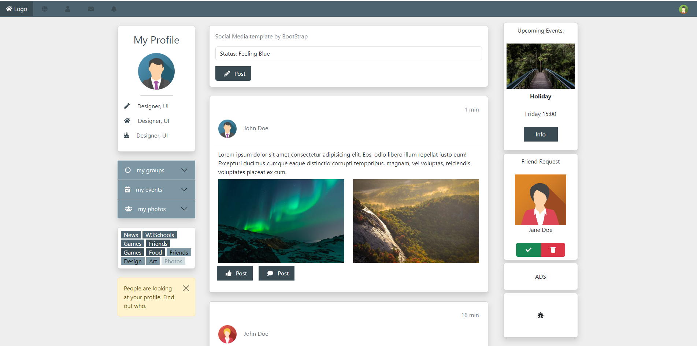

# Bootstrap_Social_Media
[Go To Demo](https://mohammedelsisi21.github.io/Bootstrap_Social_Media/)

# Description
> This repository contains a social media template built using Bootstrap.
> The design features a responsive layout with a sticky navigation bar, profile card, accordion components.

## Key Features
- **Sticky Navbar**: A responsive navbar that adjusts for different screen sizes.
- **Profile Card**: Showcases user information with a profile picture, details, and an accordion section for groups, events, and photos.
- **Post Layout**: A structured area for status updates and posts, complete with interactive buttons.
- **Responsive Design**: Adjusts seamlessly for various devices and screen sizes.
- **Additional Widgets**: Includes event reminders, friend requests, and advertisements.

## Technologies Used
- **Bootstrap**: For styling and responsive design.
- **Font Awesome**: For icons.
- **Custom CSS**: For additional styling and layout adjustments.

# Project ScreenShot
